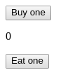

# SimpleGoldenAcornApp

## Preview



## Functionality

```gherkin
Scenario: using the SimpleGoldenAcornApp with buttons
  Given I have 0 🌰
  When I click on the 'Buy one' button
  Then the amount of 🌰 increases by one

  Given I have 1 🌰
  When I click on the 'Eat one' button
  Then the amount of 🌰 decreases by one

  Given I have 0 🌰
  When I click on the 'Eat one' button
  Then the amount of 🌰 does not change

Scenario: using the SimpleGoldenAcornApp with arrow keys
  Given I have 0 🌰
  When I press the 'Up Arrow' key
  Then the amount of 🌰 increases by one

  Given I have 1 🌰
  When I press the 'Down Arrow' key
  Then the amount of 🌰 decreases by one

  Given I have 0 🌰
  When I press the 'Down Arrow' key
  Then the amount of 🌰 does not change
```

## Mock Data

- Redux: create a default state in a goldenApp reducer
- Context API: create a default state for creating a context

```json
{
  "result": 0
}
```

## Guidance

- Create two function *-stateless-* components &mdash;
  *[functional components](https://reactjs.org/docs/components-and-props.html#functional-and-class-components)*
  - **Button** should get a function and a string via properties
  - **Display** should get a number via the special `children` property
    &mdash; *[containment](https://reactjs.org/docs/composition-vs-inheritance.html#containment)*
- Create **SimpleGoldenAcornApp** component/container
  - It should contain the business logic and get the data (from store, if you use Redux, from a default state if you use Context API)
  - It should have an **increment** and **decrease** method which updates the store/state

Optional:
- Add [`prop-types`](https://www.npmjs.com/package/prop-types) to the dependencies
- Check the properties with `prop-types`
