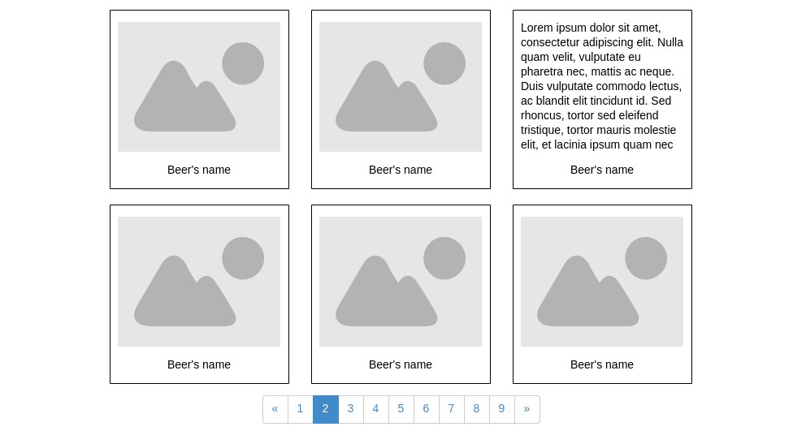
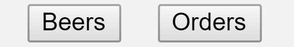
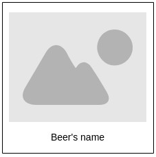
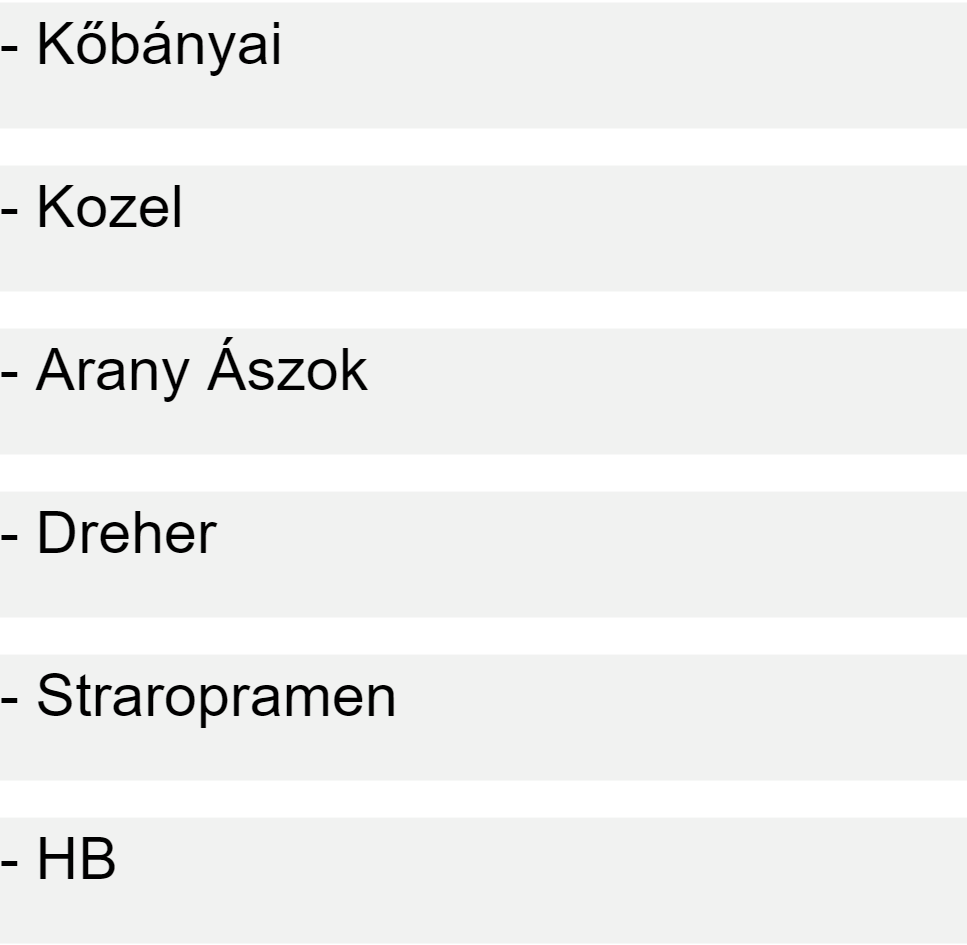

# Beer orders - Brepi

Brepi is an application where you can order Brewdog's beers.

## The purpose of the project

The purpose of the project is to get familiar with React Redux and Routing. By the end of
this project you will have a basic understanding of:

- how to work with React
- how to work with components and containers
- how to get data from an API
- how to use Redux
- how to use Routing

## What are you going to use?

- [Routing](https://reacttraining.com/react-router/)
- [Redux](https://redux.js.org/basics/usage-with-react)
- [axios](https://github.com/axios/axios)
- [Punk API](https://punkapi.com/)
  - For the data about the beers
- (Optional) [Ant Design](https://ant.design/)
  - For design elements

## Specification

Pages should be:
- Beers at /beers route
  - The container requires the following components: header, paginator, beer tile
- Beers description at /beers/:beerId route
  - The container requires the following components: header
- Orders at /orders route
  - The container requires the following components: header, order item

### Beers

The beers page must display:
- the header
- at least 6 beer tiles
- the paginator



### Paginator

The paginator should enable the user to list the next or previous page of beers.

### Header

The header must display:
- beers button or a Linkto component
- orders button or a Linkto component

*hint: if you use button, than use history for navigating*

```gherkin
Given the loaded pages
When i click on the orders button
Then I redirected to /orders

Given the loaded pages
When i click on the beers button
Then I navigated to /beers
```

*Notice: All of the pages using the same header component.**



### Beer tile

The beer tile must display the beer's:
- image
- name



```gherkin
Given the /beers page
When its loaded
Then I should see 6 beers

Given the loaded page
When I click on a tile
Then I navigated to /beers/beerId page
```

*hint: add the ordered beers to the redux **store***

### Beer description

The beer description must display the beer's:
- image
- name
- description
- order button

```gherkin
Given the /beers/:beerId page
When its loaded
Then I should see the beers description

Given the loaded page
When I click on the order button
Then its added to my orders
```

### Orders 

The Orders page must display the list of beers that you ordered.

```gherkin
Given the /orders page
When its loaded
Then I should see my orders
```



*hint: beers should be rendered from the Redux **store***
