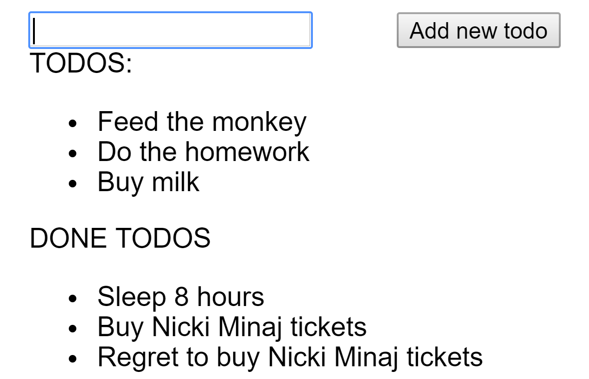

# Todo app

## Preview



## Functionality

```gherkin
Scenario 1:
  Given the loaded page
  When the input field is filled
  And i click on the button
  Then the todo is added to my todolist

Scenario 2:
  Given the loaded page
  When i leave an input field blank
  Then the button is disabled

Scenario 3:
  Given the loaded page
  When i click on a todo in my todolist
  Then its added to my done todos

Scenario 4:
  Given the loaded page
  When i click on a done todo in my done todolist
  Then its removed from the done todos
```

## Mock Data

- Redux: create a default state in a todo reducer
- Context API: create a default state for creating a context

```json
{
  "todo": [
    {
      "id": 1,
      "text": "Buy milk",
      "prio": 1
    },
    {
      "id": 2,
      "text": "Feed the monkey",
      "prio": 2
    }
  ],
  "doneTodo": [
    {
      "id": 1,
      "text": "Sleep 8 hours"
    },
    {
      "id": 2,
      "text": "Mentoring others"
    }
  ]
}
```

## Guidance

- create two functional components
  - **Todo** should get a function and a string via properties
  - **DoneTodo** should get a function and a string via properties
- create **TodoApp** component/container
  - it should contain the business logic and get the data (from store, if you use Redux, from a default state if you use Context API)
  - it should render multiple **Todo** and **DoneTodo** components (**Todo** should be order by prio)
  - it should have a *removeTodo* where you should delete done todos from the done todo list
  - it should have a *addTodo* where you should add a new todo to the todolist
  - it should have a *checkTodo* where you should check a todo and add it to the done todolist

Optional:
- create a downvote and upvote button at **Todo** component for upgrading prios
- check the properties with `prop-types`
